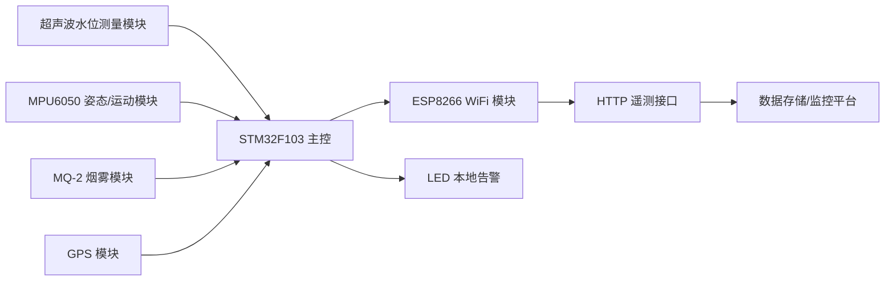
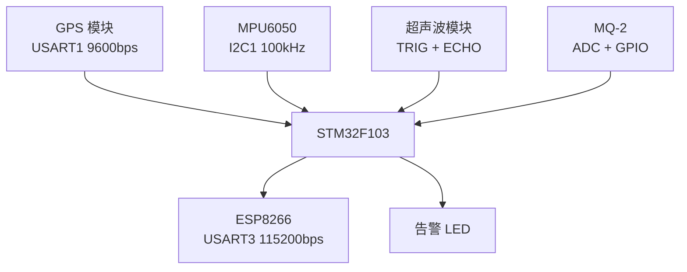
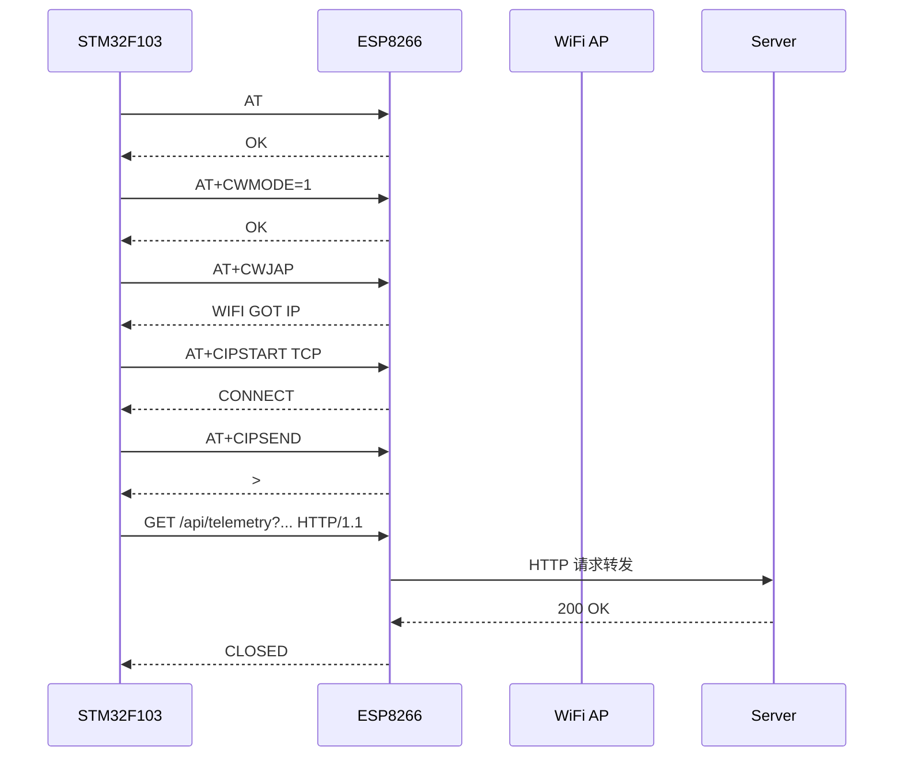

# 论文图表素材草稿

本文档用于整理 EI 会议论文所需的图表内容，可直接转绘为 Visio、draw.io 或 PPT 图。

## 图 1 系统总体架构图

建议优先使用同目录文件：
`paper/system_architecture_academic.svg`

设计风格说明：
- 黑白单色、分层边框、规范箭头，适合论文排版与灰度打印
- 采用“感知层 - 边缘控制层 - 通信层 - 后端服务层 - 前端展示层”的学术化分层表达
- 减少实现级细节，突出系统层次关系与核心数据流向
- 同时体现本地告警链路与远程监管链路两条主路径

图注建议：
面向智慧井盖场景的多维感知监控系统总体架构。系统由感知层、边缘控制层、通信传输层、后端服务层和前端展示层构成，形成终端即时告警与平台远程监管并行的双闭环监测机制。

正文引用建议：
图 1 展示了系统的总体架构及核心数据流。多源传感数据首先在终端侧完成采集与边缘判定，随后经无线链路上传至后端服务层进行处理与存储，最终由前端界面完成状态展示与异常反馈。

## 图 1-扩展 全栈系统模型图（含前后端）

建议直接使用同目录文件：
`paper/full_stack_model.svg`

图中结构说明：
- 终端感知层：超声波、MPU6050、MQ-2、GPS、LED、蜂鸣器
- 边缘控制层：STM32F103 完成采样调度、状态融合、本地告警与遥测打包
- 通信传输层：ESP8266 通过 WiFi 和 HTTP 完成数据上传
- Node.js + Fastify 后端层：负责 API 接入、参数校验、历史数据存储、SSE 实时推送与运维接口
- Vue 3 前端层：负责监控总览、设备详情、告警展示和统计分析

图注建议：
智慧井盖监控系统全栈模型图。终端侧以 STM32F103 为核心实现多源感知和边缘判定，经 ESP8266 上传至 Node.js + Fastify 后端；后端完成数据接收、校验、存储与实时推送，Vue 3 前端提供可视化监控与运维交互界面。

## 图 2 终端硬件连接框图

图注建议：
终端硬件连接关系。STM32F103 为主控核心，负责协调水位、姿态、烟雾和定位等多源信息采集，并完成边缘判定和无线通信上传。

## 图 3 软件主循环与数据流程图

建议直接使用同目录文件：
`paper/software_flow.svg`

图中步骤：
1. 解析 GPS 接收到的最新 NMEA 语句
2. 周期采样 MPU6050 并更新姿态与运动判定结果
3. 周期采样 MQ-2 模拟量与数字量并更新烟雾报警状态
4. 触发超声波测量并在定时器输入捕获中计算回波脉宽和距离值
5. 检查 ESP8266 网络连接状态，必要时执行重连
6. 按固定周期打包多源传感数据，通过 HTTP GET 接口上报到服务端

图注建议：
主循环以周期采样和定时上传为核心，兼顾井下水位监测、本地异常判定与通信重连控制。

## 图 4 遥测上传流程图

图注建议：
ESP8266 通过 AT 指令建立 TCP 连接并转发 HTTP GET 请求，实现水位、姿态、烟雾和定位等多源遥测数据上传。

## 表 1 硬件组成与功能表

| 硬件模块 | 典型接口 | 功能说明 |
| --- | --- | --- |
| STM32F103 | MCU | 系统控制与边缘计算 |
| 超声波模块 | GPIO + TIM2 | 井下水位检测 |
| MPU6050 | I2C1 | 倾斜与运动感知 |
| MQ-2 | ADC1 + GPIO | 烟雾检测 |
| GPS | USART1 | 位置与时间信息获取 |
| ESP8266 | USART3 | WiFi 接入与 HTTP 上传 |
| LED | GPIO | 本地告警提示 |

## 表 2 遥测参数说明表

| 参数名 | 数据类型 | 说明 |
| --- | --- | --- |
| `device_id` | string | 设备唯一编号 |
| `distance_mm` | integer | 超声测距值，单位 mm，可进一步换算水位高度 |
| `echo_us` | integer | 回波脉宽，单位 us |
| `tilt_x_mdeg` | integer | X 轴倾斜量，单位毫度 |
| `tilt_y_mdeg` | integer | Y 轴倾斜量，单位毫度 |
| `motion_raw` | integer | 运动强度原始量 |
| `gyro_x_raw/y_raw/z_raw` | integer | 三轴陀螺仪原始值 |
| `smoke_raw` | integer | 烟雾模拟量原始值 |
| `smoke_permille` | integer | 烟雾归一化浓度 |
| `smoke_alarm` | integer | 综合烟雾报警标志 |
| `valid` | integer | GPS 是否有效 |
| `lat/lon/sat/alt/utc` | integer/string | 定位扩展信息 |

## 表 3 实验场景与评价指标表

| 实验项目 | 实验目的 | 评价指标 |
| --- | --- | --- |
| 水位测量精度测试 | 验证超声波水位测量有效性 | 绝对误差、相对误差 |
| 倾斜检测测试 | 验证姿态判定准确性 | 触发阈值、误报情况 |
| 运动检测测试 | 验证振动识别能力 | `motion_raw` 变化、告警响应 |
| 烟雾响应测试 | 验证 MQ-2 报警能力 | AO、DO、报警时延 |
| GPS 上报测试 | 验证有效定位字段 | `valid` 与经纬度完整性 |
| 端到端时延测试 | 验证系统实时响应性能 | 平均时延、最大时延、最小时延、时延波动 |

## 表 4 测试结果汇总表模板

| 实验项目 | 场景编号 | 关键输入 | 关键输出 | 结果结论 |
| --- | --- | --- | --- | --- |
| 水位测量精度测试 | D1 | 真实液位 | `distance_mm` | 待填 |
| 倾斜检测测试 | A1 | 倾斜角度 | `tilt_x_mdeg` / `tilt_y_mdeg` | 待填 |
| 运动检测测试 | M1 | 扰动方式 | `motion_raw` | 待填 |
| 烟雾响应测试 | S1 | 烟雾刺激强度 | `smoke_raw` / `smoke_alarm` | 待填 |
| GPS 上报测试 | G1 | 室内/室外 | `valid` / `lat` / `lon` | 待填 |
| 端到端时延测试 | C1 | 测试条件 | 平均时延/波动范围 | 待填 |
